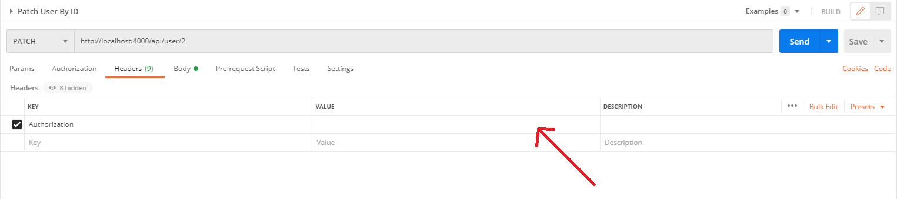
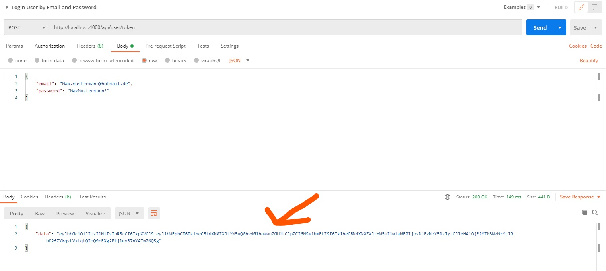

# Book-Up Backend
This project provides the necessary API for the [Book-Up Frontend](https://code.fbi.h-da.de/bookup/bookup-frontend)

## Installation

## Features

## API Documentation

## Testing

This project uses automated tests to make sure that the API runs correctly. You can find those test in `/test`.
Furthermore, you can import the Postman-Collection provieded in `/Postman` to your Postman client and execute the given tests to convince yourself that the routes are working.  

When working with Postman, make sure to adjust the request so you are refencing existing ids, when working with foreign keys, otherwise you will run in 500 Errors. 

You will also need to adjust the Postman requests for routes that need an authorization. You can distinguish between routes that need an authorization and routes that don't need an authorization by looking into the `Headers` field of the Postman request. 
If the `Headers` field looks like this:

then you will need to put the JWT into the value field (marked with a red arrow in the picture above).

To get the JWT, you need to run `Register User` request first. Then log in via `Login User by Email and Password` request. If you logged yourself in correctly, you will recieve the JWT as shown in the following picture.     

## License
MIT License
Copyright (c) Facebook, Inc. and its affiliates.
Permission is hereby granted, free of charge, to any person obtaining a copy
of this software and associated documentation files (the "Software"), to deal
in the Software without restriction, including without limitation the rights
to use, copy, modify, merge, publish, distribute, sublicense, and/or sell
copies of the Software, and to permit persons to whom the Software is
furnished to do so, subject to the following conditions:
The above copyright notice and this permission notice shall be included in all
copies or substantial portions of the Software.
THE SOFTWARE IS PROVIDED "AS IS", WITHOUT WARRANTY OF ANY KIND, EXPRESS OR
IMPLIED, INCLUDING BUT NOT LIMITED TO THE WARRANTIES OF MERCHANTABILITY,
FITNESS FOR A PARTICULAR PURPOSE AND NONINFRINGEMENT. IN NO EVENT SHALL THE
AUTHORS OR COPYRIGHT HOLDERS BE LIABLE FOR ANY CLAIM, DAMAGES OR OTHER
LIABILITY, WHETHER IN AN ACTION OF CONTRACT, TORT OR OTHERWISE, ARISING FROM,
OUT OF OR IN CONNECTION WITH THE SOFTWARE OR THE USE OR OTHER DEALINGS IN THE
SOFTWARE.
MIT © [Book-Up]()